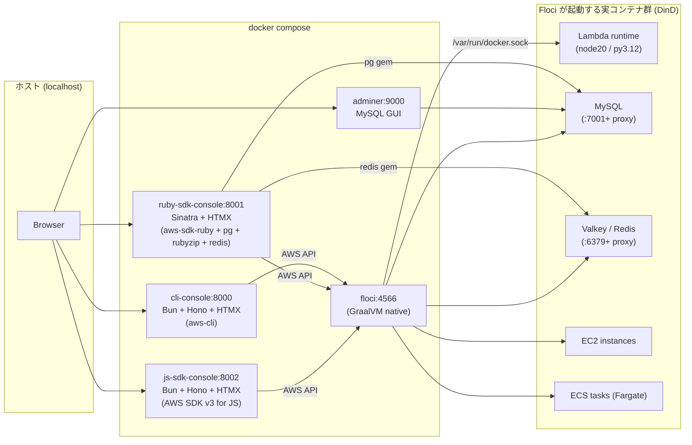
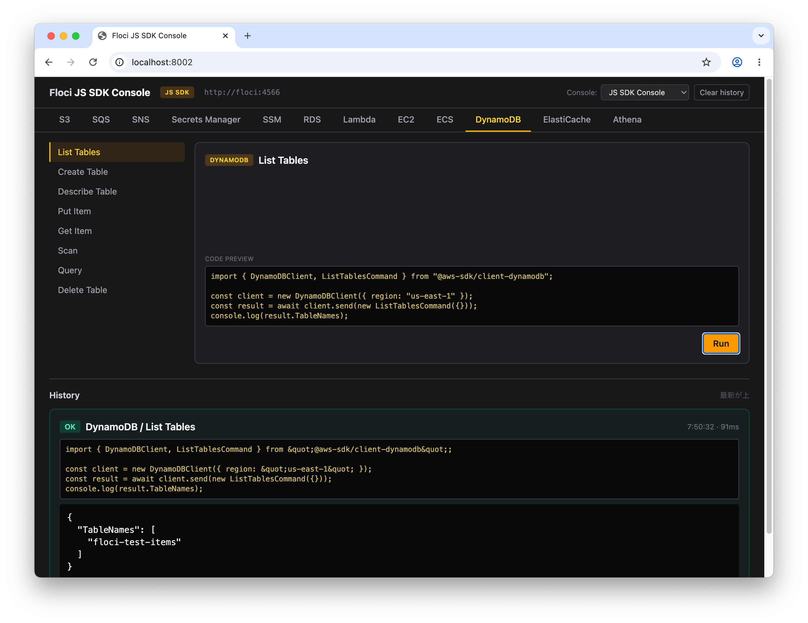

# learn-floci

ローカル AWS エミュレータ [**Floci**](https://floci.io/) を **`aws-cli`**・**`aws-sdk-ruby`**・**`AWS SDK v3 for JS`** の 3 面から触って、挙動・差分・癖を比較しながら学ぶための実験環境。

[Floci](https://floci.io/) は GraalVM ネイティブビルドの軽量 AWS エミュレータ (MIT、51 サービス、24ms 起動 / 13MiB アイドル、`http://localhost:4566` 統一エンドポイント)。Lambda / RDS / ElastiCache / MSK / ECS / EC2 / EKS / OpenSearch 等は実 Docker コンテナで動作する。LocalStack のドロップイン互換 (同じポート 4566、認証トークン不要)。

---

## アーキテクチャ



| コンテナ | URL | スタック | 役割 |
|---|---|---|---|
| **cli-console** | http://localhost:8000 | Bun + Hono + HTMX + Tailwind v4 | `aws-cli` を実行するブラウザダッシュボード |
| **ruby-sdk-console** | http://localhost:8001 | Ruby 3.3 + Sinatra + HTMX + Tailwind v4 | `aws-sdk-*` / `pg` / `rubyzip` / `redis` を実行するダッシュボード |
| **js-sdk-console** | http://localhost:8002 | Bun + Hono + HTMX + Tailwind v4 | AWS SDK v3 for JS を直接呼び出すダッシュボード |
| **floci** | http://localhost:4566 | `floci/floci:latest` | ローカル AWS エミュレータ本体 |
| **adminer** | http://localhost:9000 | `adminer:latest` | RDS (MySQL) 確認用 GUI |

Floci は `/var/run/docker.sock` をマウントして DinD で実コンテナ (Lambda runtime / MySQL / Valkey 等) を起動する。データプレーン (Redis プロトコル、MySQL プロトコル) は Floci のホストの 6379-6399 / 7001-7099 ポートに proxy 経由で公開される。3 つの Console は同一の 12 サービスを異なるインターフェース (CLI / Ruby SDK / JS SDK) で操作でき、ヘッダのドロップダウンで相互に行き来できる。

---

## スクリーンショット

<p align="center">
  
  
  
</p>
<p align="center">
  <sub><b>cli-console</b> :8000</sub>&emsp;
  <sub><b>ruby-sdk-console</b> :8001</sub>&emsp;
  <sub><b>js-sdk-console</b> :8002</sub>
</p>

サービスタブを切り替えると、左サイドバーにそのサービスのオペレーション一覧が出る。中央のカードでフィールドを編集すると、その場で **コマンド (CLI) / Ruby コード (SDK) のプレビュー** が更新される。Run すると下の History エリアに結果が積み上がる (HTMX で部分更新)。

---

## Quick start

```bash
docker compose up --build
```

初回ビルドは aws-cli / Ruby gem のダウンロードで 3〜5 分。起動後:

- CLI Console: http://localhost:8000
- Ruby SDK Console: http://localhost:8001
- JS SDK Console: http://localhost:8002
- Adminer (RDS): http://localhost:9000 (login servers は事前設定済み)

ヘッダの「Console:」セレクタで 3 つの Console を行き来できる。

### リソース作成 (Terraform)

`docker compose up` 後に Terraform でデモリソースを作成する:

```bash
cd infra/terraform
terraform init
terraform plan      # 作成されるリソースを確認
terraform apply     # リソース作成 (確認プロンプトで yes)
```

作成されるリソース:

| サービス | リソース |
|---|---|
| S3 | `floci-test-bucket` / `athena-results` (Athena 出力先) |
| SQS | `floci-test-queue` |
| SNS | `floci-test-topic` |
| Secrets Manager | `floci-test/rails-secret` |
| SSM | `/floci-test/app/environment` |
| RDS | `floci-test-db` (MySQL) |
| ElastiCache | `floci-test-cache` (Redis RG) / `floci-test-valkey` (Valkey RG) |
| DynamoDB | `floci-test-items` (1 件サンプル投入済み) |
| EC2 | `floci-test-instance` (Amazon Linux 2 / t2.micro) |
| ECS | `floci-test-cluster` + Fargate task def `floci-test-task` |
| Lambda | `floci-test-lambda` (Node.js 20.x) |

### サンプルデータ投入 (任意)

Terraform で作成したリソースにサンプルデータを投入する:

```bash
bash infra/seed/seed-sample-data.sh
```

S3 オブジェクト・SQS メッセージ・SNS publish・RDS サンプルテーブルなど、Terraform では管理しないデータプレーン操作を実行する。

---

## サービス対応表

3 つの Console で扱えるオペレーション一覧 (✓ = Preset 実装あり)。すべて実エンドポイント (`http://floci:4566`) を叩く。

| Service | Operation | CLI | Ruby SDK | JS SDK | Floci 実装 |
|---|---|:-:|:-:|:-:|---|
| **S3** | list / create-bucket / put-object / get-object / head-object / delete-object / delete-bucket / list-objects | ✓ | ✓¹ | ✓ | In-process |
| **SQS** | list / create / send-message / receive-message / delete-queue | ✓ | ✓² | ✓ | In-process |
| **SNS** | list / create-topic / publish | ✓ | ✓ | ✓ | In-process |
| **Secrets Manager** | list / create / get | ✓ | ✓ | ✓ | In-process |
| **SSM Parameter Store** | put / get / list (get-by-path) / delete | ✓ | ✓² | ✓ | In-process |
| **RDS** | describe / create / delete | ✓ | ✓³ | ✓ | **Real Docker** (MySQL) + proxy :7001+ |
| **Lambda** | list / create (Node.js) / create (Python) / invoke / get / delete | ✓ | ✓ | ✓ | **Real Docker** |
| **EC2** | describe-instances / describe-images / describe-vpcs / describe-subnets / describe-security-groups / run-instances / terminate-instances | ✓ | ✓ | ✓ | **Real Docker** (`RunInstances`) |
| **ECS** (Fargate) | list-clusters / create-cluster / register-task-definition / list-task-definitions / run-task / list-tasks / describe-tasks / delete-cluster | ✓ | ✓² | ✓ | **Real Docker** (タスク実行) |
| **DynamoDB** | list / create / describe / put-item / get-item / scan / query / delete-table | ✓ | ✓² | ✓ | In-process |
| **ElastiCache** | describe-cache-clusters / describe-replication-groups / create-replication-group (Valkey/Redis) / create-cache-cluster (Memcached) / delete | ✓ | ✓⁴ | ✓ | **Real Docker** (Valkey/Redis) + proxy :6379+ |
| **Athena** | start-query-execution / list-query-executions / get-query-execution / get-query-results | ✓ | ✓ | ✓ | In-process (**mock mode**: クエリは受理されるが結果は空) |
| **Custom** | 任意の `aws ...` を直接実行 | ✓ | — | — | |

¹ 全部 `aws-sdk-s3`。`path_style` を強制。
² 一部オペレーション省略あり (CLI 側にあり SDK 側になし、またはその逆)。
³ aws-sdk-rds の XML パーサが Floci の `<Subnets><member>...` スキーマと一部非互換なため、`describe-db-instances` は `Net::HTTP + Nokogiri` で生 XML をパースしている。他のオペレーションと `pg` 接続は SDK のまま。
⁴ Ruby 側には **`describe_replication_groups` → 取得した endpoint へ `redis` gem で接続 → PING / SET / GET / INFO** という疎通テスト Preset (`ec-ping-valkey`) もある。Valkey 8.x は Redis 互換プロトコルなので `redis` gem でそのまま喋れる。

---

## Floci 挙動メモ (実装中に踏んだ仕様)

> 公式ドキュメントだけだと拾いにくい挙動を整理。

| 観察 | 詳細 |
|---|---|
| **DynamoDB は JSON 1.0** | Floci 公式ドキュメントは "JSON 1.1" と書いているが、実際は AWS 本家と同じ `Content-Type: application/x-amz-json-1.0` でないと `Unknown operation: DynamoDB_20120810.CreateTable` になる。 |
| **ElastiCache Redis/Valkey は `CreateReplicationGroup`** | `CreateCacheCluster` で `engine=valkey` を指定すると `Engine must be 'memcached'. For Redis/Valkey use CreateReplicationGroup.` で弾かれる (これは実 AWS と同じ仕様)。Memcached だけが `CreateCacheCluster`。 |
| **bare `curl POST /` は SQS にルーティングされる** | Query プロトコルのサービス (ElastiCache 等) は SigV4 の `CredentialScope` (`.../us-east-1/elasticache/aws4_request`) でサービスを判定する。素の `curl` で `Action=CreateCacheCluster&...` を投げると **デフォルトで SQS に行く** ので、SigV4 を付ける `aws-cli` / `aws-sdk-*` 経由で seed する必要がある。 |
| **Athena は mock mode** | `start-query-execution` は `QueryExecutionId` を返し、`get-query-execution` は `RUNNING` → 最終的に成功っぽい状態に遷移するが、`get-query-results` は空のレスポンス。`list-data-catalogs` / `list-work-groups` / `list-databases` は `Action ... is not supported` で未実装。 |
| **EC2 は pre-defined AMI を返す** | `describe-images` で `ami-0abcdef1234567890` (Amazon Linux 2) / `ami-0abcdef1234567891` (Amazon Linux 2023) / `ami-0abcdef1234567892` (Ubuntu) / Windows Server などを返す。`run-instances` で指定するとそれぞれの実 Docker イメージが起動する。 |
| **Lambda 初回 invoke は ~60s、2 回目以降は数百 ms** | Floci がランタイムイメージ (`public.ecr.aws/lambda/nodejs:20` 等) を pull するため。pull 後はコンテナ再利用で速くなる。 |
| **RDS XML スキーマの非互換** | Floci の `DescribeDBInstances` レスポンスは `<Subnets><member>...` のような旧式構造で、`aws-sdk-rds` (Ruby) の XML パーサが解釈できないケースがある。CLI (`aws-cli` v2) と直接 XML パースは問題なく動く。Ruby Console では `Net::HTTP + Nokogiri` でフォールバック実装にしている。 |
| **データプレーンは proxy ポート** | ElastiCache: `floci:6379` ~ `6399` / RDS: `floci:7001` ~ `7099` (Compose で `FLOCI_SERVICES_RDS_PROXY_BASE_PORT=7001` 指定)。`describe-replication-groups` / `describe-db-instances` で実際のポートが返る。 |
| **永続化は `FLOCI_STORAGE_MODE=hybrid`** | `./data/floci/` 配下に `lambda-functions.json` / `dynamodb-items.json` / `sqs-queues.json` 等のサービス別 JSON が落ちる。`docker compose down -v` でボリュームを消すか、`./data/floci/` を消すとリセット。 |

---

## ディレクトリ構成

```
.
├── docker-compose.yml              # 5 コンテナ (floci / cli / js-sdk / ruby-sdk / adminer)
├── consoles/
│   ├── cli/                        # Bun + Hono CLI Console (:8000)
│   │   ├── Dockerfile              #   aws-cli v2 + zip + redis-tools 込み
│   │   ├── package.json
│   │   └── server.tsx              #   PRESETS 配列 + @zip / @out トークン展開
│   ├── ruby-sdk/                   # Sinatra Ruby SDK Console (:8001)
│   │   ├── Dockerfile              #   ruby:3.3-slim + libpq-dev
│   │   ├── Gemfile                 #   aws-sdk-* / nokogiri / pg / rubyzip / redis
│   │   ├── app.rb                  #   PRESETS 配列 + ERB ビュー
│   │   └── views/
│   │       ├── index.erb           #   レイアウト + タブナビ
│   │       ├── _card.erb           #   Preset カード (フォーム + コードプレビュー)
│   │       └── _history_entry.erb  #   実行履歴エントリ
│   └── js-sdk/                     # Bun + Hono JS SDK Console (:8002)
│       ├── Dockerfile              #   oven/bun:slim
│       ├── package.json            #   @aws-sdk/client-* (12 サービス)
│       └── server.tsx              #   PRESETS 配列 + SDK 直接呼び出し
├── infra/
│   ├── terraform/                  # Terraform でデモリソースを宣言的に管理
│   │   ├── terraform.tf            #   required_providers
│   │   ├── provider.tf             #   AWS provider (Floci endpoint)
│   │   ├── main.tf                 #   全リソース定義
│   │   └── lambda/
│   │       └── index.js            #   Lambda 関数コード
│   ├── seed/
│   │   └── seed-sample-data.sh     # サンプルデータ投入 (S3 object, SQS msg 等)
│   └── adminer/                    # Adminer ログインサーバ事前設定
│       ├── login-servers.php
│       └── prefill.php
└── data/floci/                     # Floci 永続データ (gitignore)
```

---

## ホストから直接 aws-cli を叩く場合

Console を経由せず手元の `aws-cli` で直接触りたいとき:

```bash
export AWS_ENDPOINT_URL=http://localhost:4566
export AWS_ACCESS_KEY_ID=test
export AWS_SECRET_ACCESS_KEY=test
export AWS_DEFAULT_REGION=us-east-1

aws s3 ls
aws rds describe-db-instances
aws lambda invoke --function-name floci-test-lambda --cli-binary-format raw-in-base64-out --payload '{}' /tmp/out.json && cat /tmp/out.json
aws elasticache describe-replication-groups
```

---

## クリーンアップ

```bash
cd infra/terraform && terraform destroy   # Terraform リソース削除
cd ../..
docker compose down -v                    # ボリュームも削除
rm -rf data/floci                         # 永続データもリセットしたい場合
```

---

## 参考

- Floci 公式: https://floci.io/floci/ — 51 services overview
- Floci サービス一覧: https://floci.io/floci/services/ — オペレーション数 / プロトコル / エンドポイント
- Floci GitHub: https://github.com/floci-io/floci
